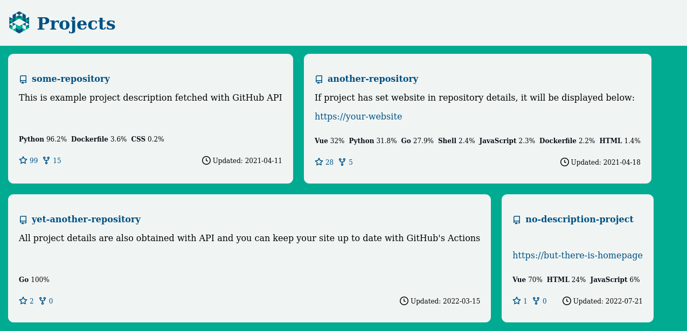

# GitHub pages generator

Generate and deploy minimalistic website with your repositories statistics with GitHub Actions.

**Key features:**

- lightweight, html and css only
- responsive, mobile friendly
- customizable and extensible

**Examples:**
- [GitHub's projects](https://adamws.github.io/github-pages-generator/) (default theme, trigger on [`master` push](https://github.com/adamws/github-pages-generator/blob/master/.github/workflows/deploy-website.yml))
- [my projects](https://adamws.github.io/) (customized theme, trigger [on schedule](https://github.com/adamws/adamws.github.io/blob/master/.github/workflows/deploy-website.yml))



## Local usage

Clone this repository, install dependencies, build and serve:

```
git clone https://github.com/adamws/github-pages-generator.git && cd github-pages-generator
python -m venv .env
source .env/bin/activate
pip install -r requirements.txt
python github-pages-generator/build.py --username <<github username>>
cd output
python -m http.server
```

After that, open `http://0.0.0.0:8000/` in browser. Files from `output` directory can be
manually committed to `gh-pages` branch or your [GitHub Pages](https://docs.github.com/en/pages/getting-started-with-github-pages/about-github-pages) repository,
but it is recommended to set up automatic deployment with [GitHub Actions](https://github.com/features/actions) which will trigger
periodically, keeping your statistics up to date.

### Rate limits

GitHub's REST API has [rate limits](https://docs.github.com/en/rest/overview/resources-in-the-rest-api#rate-limiting)
which can be easily reached while experimenting with this tool. There are two mechanisms built-in
to circumvent that:

- requests are cached with [`requests-cache`](https://requests-cache.readthedocs.io/en/stable/index.html)
- requests can be optionally authenticated with [personal access token](https://docs.github.com/en/authentication/keeping-your-account-and-data-secure/creating-a-personal-access-token) via `GITHUB_USER` and `PERSONAL_ACCESS_TOKEN` environment variables.

## Deployment

In order to deploy on your repository add this project as git `submodule` and integrate with
`.github/workflows`. Example can be seen [here](https://github.com/adamws/adamws.github.io).
Easiest way to deploy automatically is to use [peaceiris/actions-gh-pages](https://github.com/peaceiris/actions-gh-pages).
